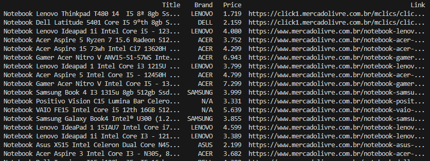

# Web Scraping-Mercadolivre
## Ricardo Marques.

Foi realizada, através de web scraping, a captura de dados do site Mercado Livre, com o objetivo de, a partir de uma chave ("Item desejado"), retornar informações relacionadas a cada produto que atendesse ao requisito especificado.

As informações extraídas foram: Título (Title), Marca (Brand), Preço (Price) e Endereço (Link) do produto.

Após a obtenção desses dados, eles foram organizados em um DataFrame e, por fim, salvos em um arquivo .csv.

### Resultado:

**Produto Buscado**
- Notebook

  

  

